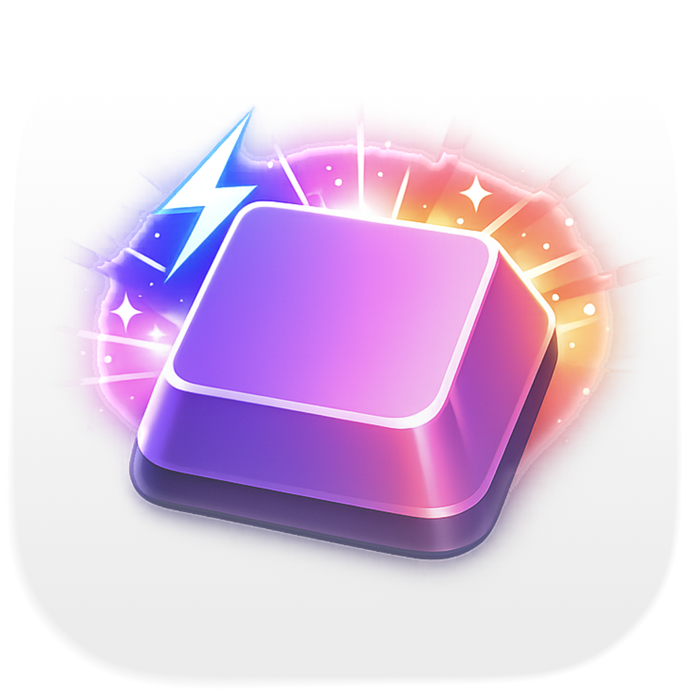

<p align="center">
  
</p>

<h1 align="center">HyperKey</h1>

<p align="center">
  <strong>AI-powered Hacker News reader for iOS and macOS</strong>
</p>

<p align="center">
  <a href="https://hyperkey.one"></a>
  <a href="https://github.com/n0an/hyperkey/blob/main/LICENSE"></a>
  
  
  <a href="https://github.com/n0an/hyperkey/releases/latest"></a>
  
  
</p>

<p align="center">
  <a href="https://github.com/n0an/hyperkey/releases/latest/download/HyperKey.dmg">
    
  </a>
</p>

---

## What is a Hyper Key?

When you press Caps Lock, HyperKey sends **Cmd+Ctrl+Opt+Shift** simultaneously. This combination is virtually never used by any application, giving you a clean namespace for custom keyboard shortcuts.

## Installation

### Homebrew (recommended)

```bash
brew tap n0an/tap
brew install --cask hyperkey-app
```

### Manual Download

Download the latest DMG from [Releases](https://github.com/n0an/hyperkey/releases).

## Features

- **Caps Lock → Hyper** - Hold Caps Lock to activate Cmd+Ctrl+Opt+Shift
- **No LED toggle** - Caps Lock LED stays off (no annoying green light)
- **Menu bar app** - Lives quietly in your menu bar, no dock icon
- **Launch at login** - Optional auto-start on system boot
- **Lightweight** - Minimal resource usage

## Usage

1. Build and run the app
2. Grant Accessibility permissions when prompted
3. Hold Caps Lock + any key to trigger Hyper shortcuts

### Setting Up Shortcuts

Once HyperKey is running, you can assign Hyper shortcuts in:

- **System Settings** → Keyboard → Keyboard Shortcuts
- **Individual app preferences**
- **Automation tools** like Raycast, Alfred, Hammerspoon, or BetterTouchTool

### Example Shortcuts

| Shortcut | Action |
|----------|--------|
| Hyper + T | Open Terminal |
| Hyper + B | Open Browser |
| Hyper + M | Open Mail |
| Hyper + R | Custom script/automation |

## Requirements

- macOS 13.0 or later
- Accessibility permissions (required for key remapping)

## Building

1. Open `HyperKey.xcodeproj` in Xcode
2. Build and run (Cmd+R)
3. Grant Accessibility permissions in System Settings → Privacy & Security → Accessibility

### Creating a DMG

To build a distributable DMG:

```bash
# Optional: install create-dmg for prettier DMGs
brew install create-dmg

# Build the DMG
./scripts/build-dmg.sh
```

The DMG will be created at `build/HyperKey.dmg`.

## How It Works

HyperKey uses IOKit HID to detect physical Caps Lock press/release events, and CGEventTap to:
1. Suppress the original Caps Lock event (prevents LED toggle)
2. Post Hyper modifier flags while Caps Lock is held
3. Add Hyper modifiers to any key pressed while Caps Lock is held

## Known Limitations

- The Caps Lock LED may briefly flash on some keyboards (hardware-level limitation)
- Requires Accessibility permissions to function

## License

MIT
